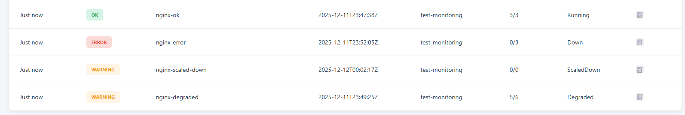

# End-to-End Verification Guide



Use these commands on your bastion/cluster to create test resources and verify the dashboard reflects the correct status.

## 1. Setup Test Namespace
```bash
oc new-project test-monitoring
#OR
oc create namespace test-monitoring
```

## 2. Test Case: OK (All Running)
Create a deployment with 3 replicas and ensure all 3 are running.

```bash
# Create Deployment
oc create deployment nginx-ok --image=nginx --replicas=3 -n test-monitoring

# Wait for rollout
oc rollout status deployment/nginx-ok -n test-monitoring

# Verify in Dashboard:
# Name: nginx-ok
# Status: Running
# Severity: OK
# Replicas: 3/3
```

## 3. Test Case: WARNING (Degraded)
Create a deployment with 3 replicas, but force one to fail.
Reliable method: Use a readiness probe that fails after some time, or during a rolling update.
Simpler for manual check:

```bash
# Create a deployment
oc create deployment nginx-degraded --image=nginx --replicas=3 -n test-monitoring

# Wait for it to be ready
oc rollout status deployment/nginx-degraded -n test-monitoring

# Patch to use a non-existent image to trigger a rolling update that hangs
oc set image deployment/nginx-degraded nginx=nginx:broken-update -n test-monitoring

oc scale deployment nginx-degraded --replicas=3 -n test-monitoring
# The new pods won't start, but old ones might be terminating or running. 
# If you catch it where Available < Desired but Available > 0, it is Degraded.
```

## 4. Test Case: ERROR (Down)
Create a deployment that cannot start (0 running, desired > 0).

```bash
# Create with broken image
oc create deployment nginx-error --image=nginx:broken-tag --replicas=3 -n test-monitoring

# Wait a moment. 
# Replicas should be 0/3 (Current/Desired) because they fail ImagePull.

# Verify in Dashboard:
# Name: nginx-error
# Status: Down
# Severity: Error
# Replicas: 0/3
```

## 5. Test Case: WARNING (Scaled Down)
Scale a deployment to 0.

```bash
# Scale down existing
oc scale deployment nginx-ok --replicas=0 -n test-monitoring

# Verify in Dashboard:
# Name: nginx-ok
# Status: ScaledDown
# Severity: Warning
# Replicas: 0/0
```

## 6. Cleanup
```bash
oc delete project test-monitoring
```
